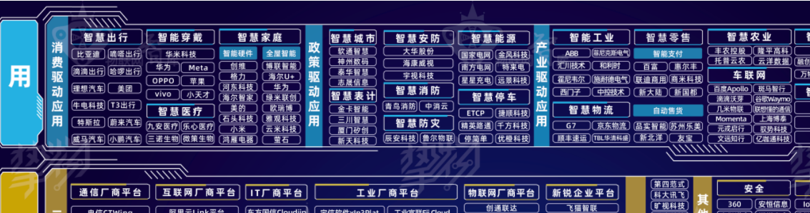

# Day1免费试听课

> 欢迎来到宏薪科技-软件测试，加油吧！少年

## 上午 | 测试行业介绍

### 1.0 无线密码

- **无线名称：CU_Y6WC**
- **无线密码：y6wcygah**

### 1.1 软件测试PPT

### 1.2 测试的平均薪资

- 职友集查看测试薪资：https://www.jobui.com/salary/beijing-ceshigongchengshi/

### 1.3 测试的使用场景

- 华为云：https://activity.huaweicloud.com/

### 1.4 物联网

## 下午 | 计算机的组成

### **概念**

- 计算机就是一台可以自动高效完成计算的电子设备，我们称之为电脑（PCpersonal computer）
- 电脑系统来分：

- - windows 系统（Inter处理器 和 AMD处理器）
  - Mac系统（编程，性能比较好）M1处理器 
  - Linux系统（阿里云服务器、腾讯云服务器）

### **计算机的组成**

- 硬件：硬盘，键盘，显示器，鼠标、**中央处理器 cpu**、内存、网卡、主板 等组成计算机的那些物理设备，看的见摸的着的。

- 

- 软件：安装在硬件上或者计算机上，供用户使用的操作指令。一个软件就是多个不同的指令组成的。
- 操作系统：Unix 和Linux 的区别：大型服务器、阿里云、腾讯云 都是用的 Linux
- 应用软件：微信、QQ 通过编程人员自己来开发的叫做 应用软件；
- 开发语言：.net；APP开发语言：后端java、前端HTML、VUE、JS

### **计算机常用快捷键**

- tab键 后边学习提示符号，路径补全，使用tab键自动补全
- alt+tab 切换窗口	
- ctrl+tab 内部切换窗口；例如：在浏览器中切换窗口	
- ctrl+A 全选
- ctrl+C 复制
- ctrl+V 粘贴 
- ctrl+X 剪切
- ctrl+S 保存
- ctrl+Z 撤销

### **如何购买一台性价比较高的计算机？**

- 例如：想购买一台笔记本，看了淘宝、京东推荐的电脑很多，电脑品牌很多：联想、华硕、戴尔，惠普，不知道购买那个？

**教你查看电脑性能**

- 第一步：打开鲁大师官网：https://www.ludashi.com/
- 第二步：点击实验室

- 第三步：点击 排行天梯

- 第四步：查看服务器性能

- 第五步：按照性能排行榜，到京东、淘宝 来购买电脑

## 在线打字

- https://dazi.kukuw.com/

## 作业 | 电脑配置-硬件/软件区别

1. 查看自己的电脑配置
2. 区分什么是硬件、什么是软件（截图来显示）

1. 1. 例如：硬件-CPU的图片

1. 记住：

- ctrl+A 全选
- ctrl+C 复制
- ctrl+V 粘贴 
- ctrl+X 剪切
- ctrl+S 保存
- ctrl+Z 撤销
